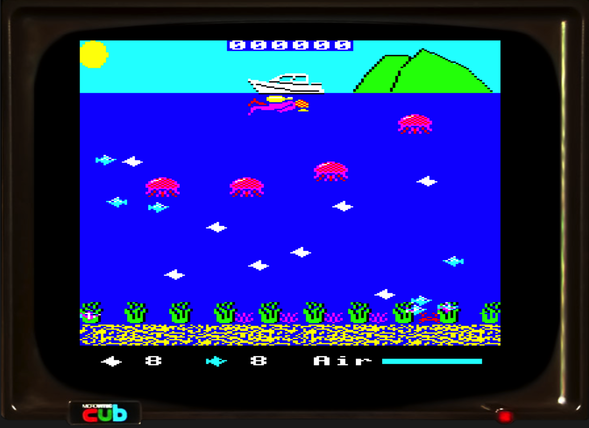
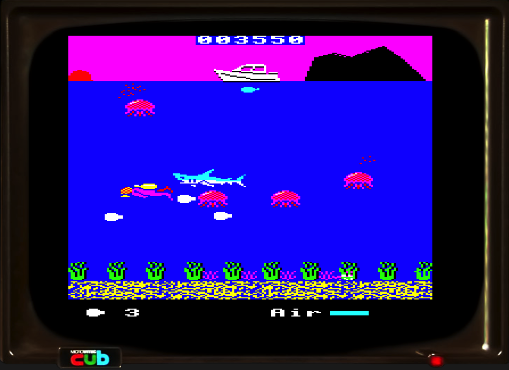
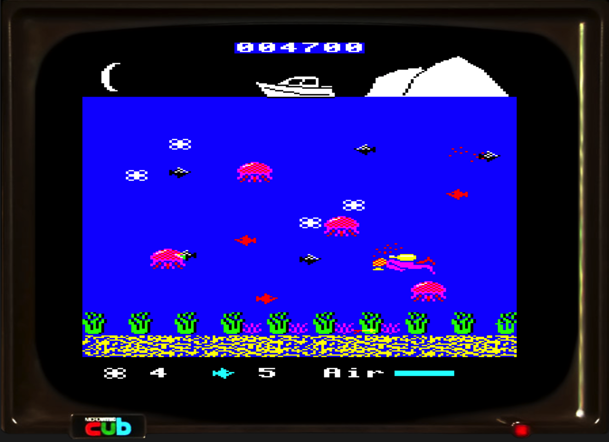

# Polymer Picker (BBC Basic/Assembler version)
A BBC Basic and Assembler version of the Polymer Picker game.

[Play online](https://bbc.godbolt.org/?disc=https://www.sassquad.net/downloads/polymer-picker/polymer-picker-assembly.ssd&autoboot) or [watch a playthrough video](https://youtu.be/hrgzWWyr84Y).

## About the game



Your local coastline has become polluted with discarded plastic, which is harming the aquatic wildlife. Dive in, and collect the rubbish, before the fish consume it and die.

Each level contains 8 items to collect. You then proceed to the next level. The fish are initially harmless, but later levels require you to avoid the fish if you can, or they may injure you. The jellyfish are a constant menace, their sting will hurt you. Then of course, there's the sharks to contend with.

As you progress, you have the ability to swim faster. This will consume more oxygen, however. When your airtank reaches about 50%, a spare tank will appear underneath your boat. Grab it to replenish your air. 

Points are earned for each item of plastic collected. At the end of a level, a bonus is awarded for each fish that is left, in addition to any remaining air in your tank.

If you run out of air, or all the fish die, then it's game over.

## Play online

The current latest version can be played online. You'll need a desktop/laptop computer or a tablet with a keyboard to play this.

[Play online](https://bbc.godbolt.org/?disc=https://www.sassquad.net/downloads/polymer-picker/polymer-picker-assembly.ssd&autoboot)

## Watch a playthrough video of the game

[https://youtu.be/andCxDNpfJA](https://youtu.be/hrgzWWyr84Y)

## How did this game come about?

The game was started in September 2021 and initially released in December 2022. A new edition was released in September 2023 to include jellyfish as an added hazard, along with some other tweaks. Previous versions can be downloaded from the [game's dedicated Stardot thread](https://stardot.org.uk/forums/viewtopic.php?f=53&t=23615).





## How to build from source

Although the disc image is included here, there are files included to help you build your own copy of the game. You will require the following:

* [Beebasm](https://github.com/stardot/beebasm)

On more recent versions of Mac OS, Beebasm must be rebuilt from source, in order to run in the 64-bit environment. 

This repo includes the build process employed on my Apple iMac, which not only includes a build of BeebAsm, but the following tools/software:

* [b2 emulator](https://github.com/tom-seddon/b2)
* [Visual Studio Code](https://github.com/microsoft/vscode) (using the [Beeb VSC extension](https://github.com/simondotm/beeb-vsc), which offers some BASIC syntax highlighting)
* [basictool](https://github.com/ZornsLemma/basictool) - a tool I've used to compress the code to fit into memory. Recent versions are harder to read as a result. I'll try and put an uncompressed version into the repo in the future. The process involved is manual - automating this step, results in the code not working, so some further changes are required in the future to make this build process work without issue.

VS Code's Tasks feature is employed to good effect here, by allowing a 'build' and 'test' task, the former runs the shell script `build.sh` which kicks beebasm, containing the following script:

`beebasm -i Polymer-Picker-6502.asm -do PP6502.ssd -opt 3 -title PP6502`

The `Polymer-Picker-6502.asm` file consists of the following:

```
PUTTEXT "src/BOOT.txt", "!BOOT",&FFFFFF,&FFFFFF
PUTBASIC "src/POLYSCR.bas","POLYSCR"
PUTFILE "src/PPBY.bin","PPBY",&FF1800,&FF1800
PUTFILE "src/PPSCR.bin","PPSCR",&FF3000,&FF3000
PUTBASIC "src/POLY2.bas","POLY2"
ORG &2B00
.start
INCBIN "src/LDIVER.bin"
INCBIN "src/RDIVER.bin"
INCBIN "src/LFISH.bin"
INCBIN "src/RFISH.bin"
INCBIN "src/LSHK.bin"
INCBIN "src/RSHK.bin"
INCBIN "src/DLFISH.bin"
INCBIN "src/DRFISH.bin"
INCBIN "src/FSHK.bin"
INCBIN "src/JELLY.bin"
.end
SAVE "SPRITES",start,end
PUTBASIC "src/POLY1.bas","POLY1"
PUTBASIC "src/POLY3.bas","POLY3"
PUTBASIC "src/POLY4.bas","POLY4"
```

The following attempts to paraphrase an approach in more efficient memory management of the game, and some nifty loading techniques, which improve the loading time, and playability of the game, as performed by Stardot forum member 'hexwab' - any errors or omissions are my fault.

The above build file takes the files within the `src` folder, and outputs them in the correct format, prior to building the disc image. In a major change from the BASIC version, sprite files are present. The individual sprites are merged into a single sprite file, `SPRITES`, for more efficient loading. The other files are assembled close to each other in the disc image, also for more efficient loading.

Due to some recently introduced changes, the game files are now loaded in a different order to that of their filenames. `POLYSCR` is loaded first, which displays two screen files. Although `PPBY.bin` was originally output into high resolution MODE 0, `POLYSCR` now loads it into a smaller version of MODE 1, to shorten loading time, and allow the use of a neat fade in and out effect, before loading the main title screen `PPSCR`.

While the title screen is displayed, some further loading of files is performed 'in the background', starting with `POLY2` which contains some assembly language for the sprite routines. These have been further optimised for speed and efficiency. The `SPRITES` file is loaded into memory, before `POLY1` is loaded, which contains the instructions.

Before the instructions are displayed, `POLY1` *LOADs the two remaining BASIC files - `POLY3` and `POLY4` - into various memory locations. At this point, the loading screen will then invite you to press the spacebar to continue. This will display the options screen in MODE 7 straight away - there is no further loading required from this point.

Once you are finished with the instructions, or redefining the keys, a small piece of assembler code is run which relocates the game into a lower portion of memory, before running the game. MODE 7 uses 1k of memory for the high score table, while the game uses MODE 2, which uses 20k of the BBC Micro's 32k of memory - so there isn't much left to play with!

`POLY4` contains a variety of VDU numbers which are read into string variables, for use in `POLY3`, along with some high score table data. The string variables are used in the game, and render in a faster manner in BASIC than using decimal VDU values, performed in previous versions.

`POLY3` is the game code itself, which remains heavily compacted. The above technique has freed up about 1.5k of memory with which to add new features, or perform further refinements.

Essentially, the `beebasm` call includes the `-opt 3` flag, that enables the disc image to be executable. The following line:

`PUTTEXT "src/BOOT.txt", "!BOOT",&FFFFFF,&FFFFFF`

within `Polymer-Picker-6502.asm`, ensures the bootfile is created with the correct hooks to allow it to work, and is saved to a higher sector in the disc image, so it is found more quickly when booting.

The bootfile itself is fairly standard:

```
*BASIC
*FX21
CLOSE#0:PAGE=&1100:CHAIN"POLYSCR"
```

This boot content appears on a lot of disc images within the BBC Micro Game Archive's disc images, and basically ensures the computer, or emulator is all set up correctly, and has no 'open' files to corrupt disc images, prior to running the disc image. At least, that's what I believe.

I have performed this build on the Windows platform, the `tasks.json` file requires minor tweaking concerning where you put the beebasm.exe and your emulator. Other than this, the tasks work well.

## Acknowledgements

As per my other games, some of the work here was only possible, thanks to the efforts of the [Stardot](https://www.stardot.org.uk) community.

The following people within the Stardot community were very helpful in my endeavours to get this version of the game to fruition. Check out the [game's dedicated Stardot thread](https://stardot.org.uk/forums/viewtopic.php?f=53&t=23615) for details of the game's evolution.

* jms2 - for huge efforts in providing the assembler routines (taken from Jonathan Griffith's respected book Creative Assembler for the BBC Micro), the intial sprite creations, and assistance with user definable keys.
* ChrisB - for helping out in issues of collision detection, in some of the earlier editions of the game.
* lurkio - for some essential debugging, particularly with random seeding.
* TobyLobster - for some essential debugging, particularly with random seeding, and assistance in debugging of the user definable keyboard routine.
* fizgog - for some later playtesting, discovering of memory leaks, and high score table breakages.
* hexwab - for some invaluable efforts (described above) that have improved the loading sequence, and sprite routine for faster gameplay, as well as freeing up extra memory.

Special mention to Colin Hoad, Richard Toohey for your comments on the game, and to David Edwards of [Every Game Going](https://www.everygamegoing.com) for his [review of the original release](https://www.everygamegoing.com/larticle/polymer-picker/59205), whose suggestion of adding jellyfish to enhance the gameplay gave me the push needed to add it in.

Thanks for reading. I hope you enjoy what you find. All feedback is welcome!
