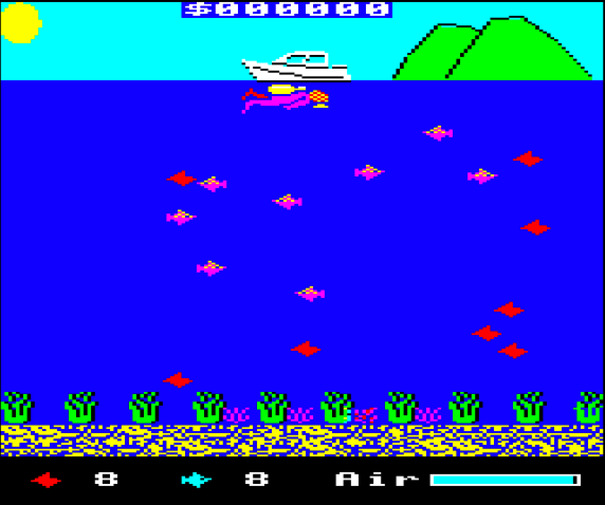

# Polymer Picker (BBC Basic/Assembler version)
A BBC Basic and Assembler version of the Polymer Picker game.

## About the game

Your local coastline has become polluted with discarded plastic, which is harming the aquatic wildlife. Dive in, and collect the rubbish, before the fish consume it and die.

Each level contains 8 items to collect. You then proceed to the next level. The fish are initially harmless, but later levels require you to avoid the fish if you can, or they may injure you. Then of course, there's the sharks to contend with.

As you progress, you have the ability to swim faster. This will consume more oxygen, however. When your airtank reaches about 50%, a spare tank will appear underneath your boat. Grab it to replenish your air. You only have one refill per level though, so use it sparingly.

Cash is earned for each item of plastic collected. At the end of a level, a bonus is awarded for each fish that is left.

If you run out of air, or all the fish die, then it's game over.

## Play online

The current pre-release version can be played online. You'll need a desktop/laptop computer or a tablet with a keyboard to play this. I have not yet tried this game on BeebDroid, but it's likely to play poorly, the older your mobile device is.

[Play online](https://bbc.godbolt.org/?disc=https://www.sassquad.net/downloads/polymer-picker/polymer-picker-assembly-v0-14.ssd&autoboot)

## How did this game come about?

Work on this game started in September 2021, and is due for release sometime in November 2022. Previous versions can be downloaded from the [game's dedicated Stardot thread](https://stardot.org.uk/forums/viewtopic.php?f=53&t=23615).



## How to build from source

Although the disc image is included here, there are files included to help you build your own copy of the game. You will require the following:

* [Beebasm](https://github.com/stardot/beebasm)

On more recent versions of Mac OS, Beebasm must be rebuilt from source, in order to run in the 64-bit environment. 

This repo includes the build process employed on my Apple iMac, which not only includes a build of BeebAsm, but the following tools/software:

* [b2 emulator](https://github.com/tom-seddon/b2)
* [Visual Studio Code](https://github.com/microsoft/vscode) (using the [Beeb VSC extension](https://github.com/simondotm/beeb-vsc), which offers some BASIC syntax highlighting)
* [basictool](https://github.com/ZornsLemma/basictool) - a tool I've used to compress the code to fit into memory. Recent versions are harder to read as a result. I'll try and put an uncompressed version into the repo in the future. The process involved is manual - automating this step, results in the code not working, so some further changes are required.

VS Code's Tasks feature is employed to good effect here, by allowing a 'build' and 'test' task, the former runs the shell script `build.sh` which kicks beebasm, containing the following script:

`beebasm -i Polymer-Picker-6502.asm -do PP6502.ssd -opt 3 -title PP6502`

The `Polymer-Picker-6502.asm` file consists of the following:

```
PUTBASIC "src/POLYSCR.bas","POLYSCR"
PUTBASIC "src/POLY1.bas","POLY1"
PUTBASIC "src/POLY2.bas","POLY2"
PUTBASIC "src/POLY3.bas","POLY3"
PUTFILE "src/LFISH.bin","LFISH",0
PUTFILE "src/RFISH.bin","RFISH",0
PUTFILE "src/DLFISH.bin","DLFISH",0
PUTFILE "src/DRFISH.bin","DRFISH",0
PUTFILE "src/LSHK.bin","LSHK",0
PUTFILE "src/RSHK.bin","RSHK",0
PUTFILE "src/LDIVER.bin","LDIVER",0
PUTFILE "src/RDIVER.bin","RDIVER",0
PUTFILE "src/PPBY.bin","PPBY",0
PUTFILE "src/PPSCR.bin","PPSCR",0
PUTTEXT "src/BOOT.txt", "!BOOT",&FFFF
```

This takes the files within the `src` folder, and outputs them in the correct format, prior to building the disc image. In a major change from the BASIC version, sprite files are present. Once the instructions are displayed within `POLY1`, these sprites are loaded into memory by `POLY2`, after the sprite handling routines have been assembled. `POLY3` contains all the game code, which uses various CALLs to the sprite handlers to display the graphics.

The invocation of the bootfile, to make the disc autorun, was initially the missing element from making this disc image complete. This is due to BeebAsm's normal staple being the building of 6502 code files, invoked via `*RUN`. This approach doesn't work with BASIC files, as these are normally run with the `CHAIN` command, so it required a bit more Googling to find the correct way to build the bootfile for the game. 

Essentially, the `beebasm` call includes the `-opt 3` flag, that enables the disc image to be executable. The following line:

`PUTTEXT "src/BOOT.txt", "!BOOT",&FFFF`

within `Polymer-Picker-6502.asm`, ensures the bootfile is created with the correct hooks to allow it to work.

The bootfile itself is fairly standard:

```
*BASIC
*FX21
CLOSE#0:CHAIN "POLYSCR"
```

This boot content appears on a lot of disc images within the BBC Micro Game Archive's disc images, and basically ensures the computer, or emulator is all set up correctly, and has no 'open' files to corrupt disc images, prior to running the disc image. At least, that's what I believe.

I have performed this build on the Windows platform, the `tasks.json` file requires minor tweaking concerning where you put the beebasm.exe and your emulator. Other than this, the tasks work well.

## Acknowledgements

As per my other games, some of the work here was only possible, thanks to the efforts of the [Stardot](https://www.stardot.org.uk) community.

The following people within the Stardot community were very helpful in my endeavours to get this version of the game to fruition. Check out the [game's dedicated Stardot thread](https://stardot.org.uk/forums/viewtopic.php?f=53&t=23615) for details of the game's evolution.

* jms2 - for huge efforts in providing the assembler routines (taken from Jonathan Griffith's respected book Creative Assembler for the BBC Micro), the intial sprite creations, and assistance with user definable keys.
* ChrisB - for helping out in issues of collision detection, in some of the earlier editions of the game
* lurkio - for some essential debugging, particularly with random seeding.
* TonyLobster - for some essential debugging, particularly with random seeding, and assistance in debugging of the user definable keyboard routine.

Special mention to colinhoard, fizzgog and Richard Toohey for your comments on the game.

Thanks for reading. The game is due for release in November 2022. In the meantime, I hope you enjoy what you find. All feedback is welcome.
