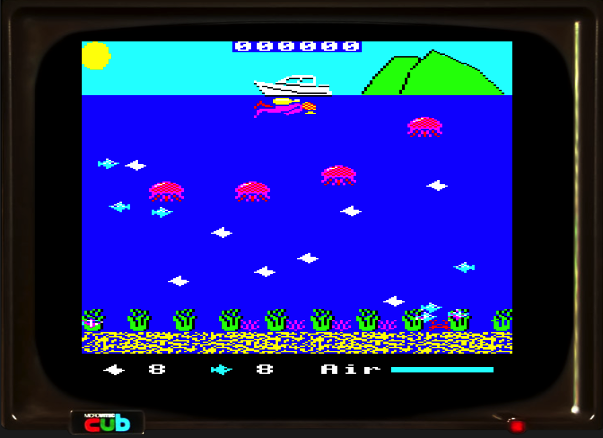
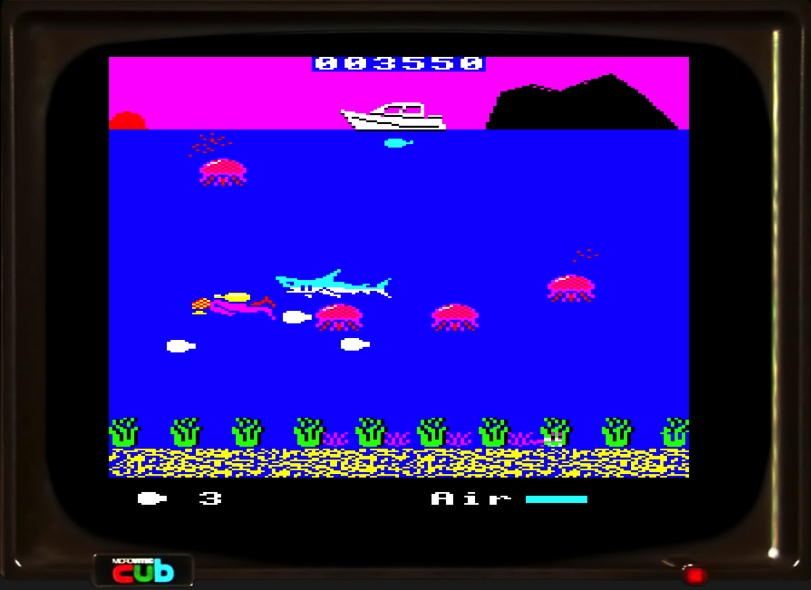
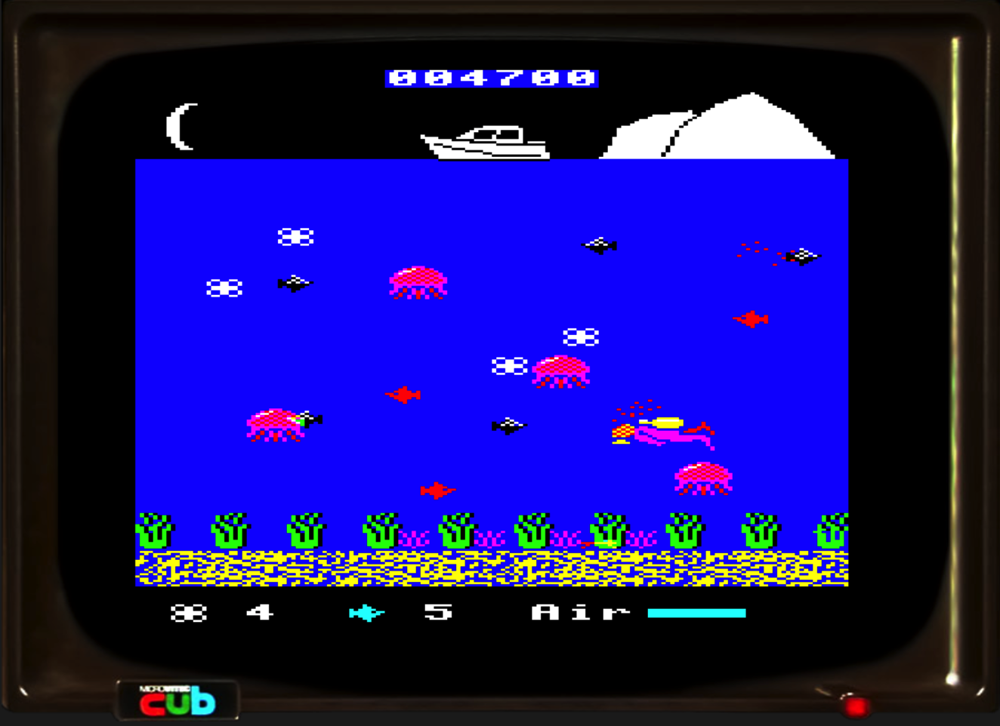

# Polymer Picker (BBC Micro, machine-code version)
A version of the Polymer Picker game for the BBC Micro, with the game loop written in 6502 machine code.

[Play online](https://bbc.godbolt.org/?disc=https://www.sassquad.net/downloads/polymer-picker/polymer-picker-assembly.ssd&autoboot) or [watch a playthrough video](https://youtu.be/hrgzWWyr84Y).

## About the game



Your local coastline has become polluted with discarded plastic, which is harming the aquatic wildlife. Dive in, and collect the rubbish, before the fish consume it and die.

Each level contains 8 items to collect. You then proceed to the next level. The fish are initially harmless, but later levels require you to avoid the fish if you can, or they may injure you. The jellyfish are a constant menace, their sting will hurt you. Then of course, there's the sharks to contend with.

As you progress, you have the ability to swim faster. This will consume more oxygen, however. When your airtank reaches about 50%, a spare tank will appear underneath your boat. Grab it to replenish your air. 

Points are earned for each item of plastic collected. At the end of a level, a bonus is awarded for each fish that is left, in addition to any remaining air in your tank.

If you run out of air, or all the fish die, then it's game over.

## Play online

The current latest version can be played online. You'll need a desktop/laptop computer or a tablet with a keyboard to play this.

[Play online](https://bbc.godbolt.org/?disc=https://www.sassquad.net/downloads/polymer-picker/polymer-picker-assembly.ssd&autoboot)

## Watch a playthrough video of the game

[https://youtu.be/andCxDNpfJA](https://youtu.be/hrgzWWyr84Y)

## How did this game come about?

The game was started in September 2021 and initially released in December 2022. A new edition was released in September 2023 to include jellyfish as an added hazard, along with some other tweaks. Version 2.00 followed in September 2026, and is the biggest change yet - the per-frame game loop was rewritten in 6502 machine code, replacing the BASIC that used to drive it, and the spare air tank now has to be earned rather than collected on the spot. Previous versions can be downloaded from the [game's dedicated Stardot thread](https://stardot.org.uk/forums/viewtopic.php?f=53&t=23615).





## How to build from source

Although the disc image is included here, there are files included to help you build your own copy of the game. You will require the following:

* [Beebasm](https://github.com/stardot/beebasm)

On more recent versions of Mac OS, Beebasm must be rebuilt from source, in order to run in the 64-bit environment. 

This repo includes the build process employed on my Apple iMac, which not only includes a build of BeebAsm, but the following tools/software:

* [b2 emulator](https://github.com/tom-seddon/b2)
* [Visual Studio Code](https://github.com/microsoft/vscode) (using the [Beeb VSC extension](https://github.com/simondotm/beeb-vsc), which offers some BASIC syntax highlighting)
* [basictool](https://github.com/ZornsLemma/basictool) - a tool I've used to compress the code to fit into memory. Recent versions are harder to read as a result. I'll try and put an uncompressed version into the repo in the future. The process involved is manual - automating this step, results in the code not working, so some further changes are required in the future to make this build process work without issue.

VS Code's Tasks feature is employed to good effect here, by allowing a 'build' and 'test' task, the former runs the shell script `build.sh` which kicks beebasm, containing the following script:

`beebasm -i Polymer-Picker-6502.asm -do PP6502.ssd -opt 3 -title PP6502`

The `Polymer-Picker-6502.asm` file consists of the following:

```
PUTTEXT "src/BOOT.txt", "!BOOT",&FFFFFF,&FFFFFF
PUTBASIC "src/POLYSCR.bas","POLYSCR"
PUTFILE "src/PPBY.bin","PPBY",&FF1800,&FF1800
PUTFILE "src/PPSCR.bin","PPSCR",&FF3000,&FF3000
PUTBASIC "src/POLY1.bas","POLY1"
PUTBASIC "src/POLY3.bas","POLY3"

; COPY (engine relocator), UDG (characters) and the critter sprites
INCLUDE "src/support.asm"

ORG &2B00
.sprites_start
INCBIN "src/LDIVER.bin"
INCBIN "src/RDIVER.bin"
INCBIN "src/LFISH.bin"
INCBIN "src/RFISH.bin"
INCBIN "src/LSHK.bin"
INCBIN "src/RSHK.bin"
INCBIN "src/DLFISH.bin"
INCBIN "src/DRFISH.bin"
INCBIN "src/FSHK.bin"
INCBIN "src/JELLY.bin"
.sprites_end
SAVE "SPRITES", sprites_start, sprites_end

; GFX (the sprite plotter at &900) and the machine-code engine (&0E00)
INCLUDE "src/engine.asm"
```

The following attempts to paraphrase an approach in more efficient memory management of the game, and some nifty loading techniques, which improve the loading time, and playability of the game, as performed by Stardot forum member 'hexwab' - any errors or omissions are my fault.

The above build file takes the files within the `src` folder, and outputs them in the correct format, prior to building the disc image. In a major change from the BASIC version, sprite files are present. The individual sprites are merged into a single sprite file, `SPRITES`, for more efficient loading. The other files are assembled close to each other in the disc image, also for more efficient loading.

Due to some recently introduced changes, the game files are now loaded in a different order to that of their filenames. `POLYSCR` is loaded first, which displays two screen files. Although `PPBY.bin` was originally output into high resolution MODE 0, `POLYSCR` now loads it into a smaller version of MODE 1, to shorten loading time, and allow the use of a neat fade in and out effect, before loading the main title screen `PPSCR`.

`POLYSCR` then chains `POLY1`, which sets up the characters and sound envelopes, and contains the instructions and the redefinable keys. Once you are finished with those, `POLY1` writes your chosen keys into memory and chains `POLY3`.

`POLY3` loads everything the game needs and then hands over to the machine-code engine. It keeps the parts of the game that only run once per level or between games - the scenery, the level flow, and the hall of fame - while the engine does everything that happens every frame.

## The machine-code engine

The per-frame game loop was rewritten in 6502 assembler, replacing the interpreted BASIC that used to drive it. The engine handles the diver, the junk items, the fish, the shark, the jellyfish, all the collision tests, the air supply, the sound and the on-screen score and counters. It runs locked to the vertical sync, advancing the game state once every five frames, which reproduces the pace of the original BASIC version.

The source is in three files:

* `src/memorymap.asm` - the single source of truth for every fixed address, and the rules about which areas of memory are safe to use and when
* `src/gfx.asm` - the sprite plotter and the collision test, taken from the original inline assembler and assembled to `&900`
* `src/engine.asm` - the engine itself

There is a wrinkle in getting the engine into memory. It runs at `&0E00`, but that address is the disc filing system's own workspace, so anything loaded there while the DFS is still in use gets quietly corrupted. `POLY3` therefore loads the engine into screen memory first, waits for the drive to stop, switches to the tape filing system with `*TAPE` to release the workspace, and then block-copies the engine down into place with a small relocator. This is the same trick the BASIC version used to move itself down, applied to the engine instead.

The memory below the screen ends up looking like this:

```
&0900-&0A08  GFX      sprite plotter and collision test
&0A30-&0A70  CRIT     sea-bed critter sprites
&0A70-&0A91  COPY     the engine relocator
&0AB0-&0AFF  the fish, jellyfish and junk arrays
&0C00-&0CE0  UDG      user defined characters
&0D00-&0D20  the screen row table
&0E00-&1D00  ENGINE   the machine-code game loop
&1D00-&2870  POLY3    scenery, level flow and hall of fame
&2B00-&2FFF  SPRITES
&3000-&7FFF  the MODE 2 screen
```

BASIC and the engine talk to each other through a few bytes at `&0B00`. BASIC tells the engine which level to draw and whether this is a new game; the engine tells BASIC why it stopped - the level was cleared, the air ran out, or all the fish died - and leaves the score somewhere BASIC can read it for the hall of fame. Because the engine borrows BASIC's zero page while it runs, it saves and restores it around every call.

Essentially, the `beebasm` call includes the `-opt 3` flag, that enables the disc image to be executable. The following line:

`PUTTEXT "src/BOOT.txt", "!BOOT",&FFFFFF,&FFFFFF`

within `Polymer-Picker-6502.asm`, ensures the bootfile is created with the correct hooks to allow it to work, and is saved to a higher sector in the disc image, so it is found more quickly when booting.

The bootfile itself is fairly standard:

```
*BASIC
*FX21
CLOSE#0:PAGE=&1100:CHAIN"POLYSCR"
```

This boot content appears on a lot of disc images within the BBC Micro Game Archive's disc images, and basically ensures the computer, or emulator is all set up correctly, and has no 'open' files to corrupt disc images, prior to running the disc image. At least, that's what I believe.

I have performed this build on the Windows platform, the `tasks.json` file requires minor tweaking concerning where you put the beebasm.exe and your emulator. Other than this, the tasks work well.

## Acknowledgements

As per my other games, some of the work here was only possible, thanks to the efforts of the [Stardot](https://www.stardot.org.uk) community.

The following people within the Stardot community were very helpful in my endeavours to get this version of the game to fruition. Check out the [game's dedicated Stardot thread](https://stardot.org.uk/forums/viewtopic.php?f=53&t=23615) for details of the game's evolution.

* jms2 - for huge efforts in providing the assembler routines (taken from Jonathan Griffith's respected book Creative Assembler for the BBC Micro), the intial sprite creations, and assistance with user definable keys.
* ChrisB - for helping out in issues of collision detection, in some of the earlier editions of the game.
* lurkio - for some essential debugging, particularly with random seeding.
* TobyLobster - for some essential debugging, particularly with random seeding, and assistance in debugging of the user definable keyboard routine.
* fizgog - for some later playtesting, discovering of memory leaks, and high score table breakages.
* hexwab - for some invaluable efforts (described above) that have improved the loading sequence, and sprite routine for faster gameplay, as well as freeing up extra memory.

Special mention to Colin Hoad, Richard Toohey for your comments on the game, and to David Edwards of [Every Game Going](https://www.everygamegoing.com) for his [review of the original release](https://www.everygamegoing.com/larticle/polymer-picker/59205), whose suggestion of adding jellyfish to enhance the gameplay gave me the push needed to add it in.

Thanks for reading. I hope you enjoy what you find. All feedback is welcome!
